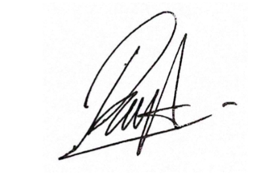
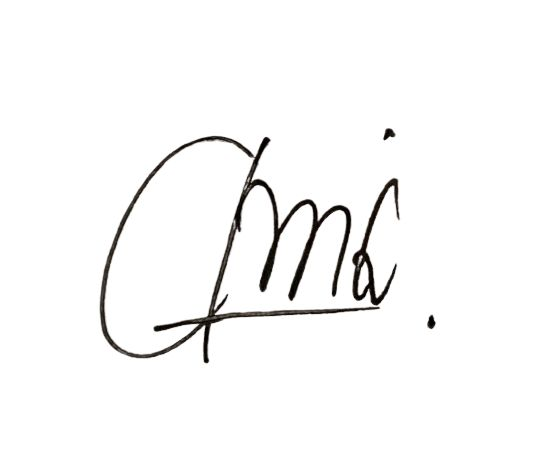
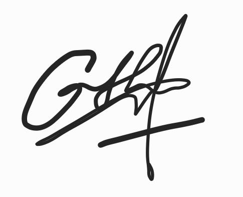

# Deklarasi Penggunaan AI

## Tugas Besar IF2150 - Rekayasa Perangkat Lunak

| Informasi | Keterangan |
|---|---|
| Kelas | K-03 |
| Nomor Kelompok | G-05 |
| Nama Kelompok | HEYSRIUSLAH |
| Nama Perangkat Lunak | LawHub |

**Anggota Kelompok:**

| NIM | Nama |
|---|---|
| 13525057 | Raya Medina Farrelin |
| 13525003 | Cherinette Corsane Khassyah Purceria |
| 13525108 | Khasya Nurul Amini |
| 13525150 | Livy Chandra|
| 13525138 | Cathrine Angel Siburian |

---

### Daftar Isi
* [Milestone 1](#milestone-1)
* Notes: Copy bagian Daftar Isi seperti Milestone 1 untuk Milestone berikutnya, contoh ``* [Milestone 2](#milestone-2)``. Ketika Daftar isi diklik maka akan langsung diarahkan ke bagian bawah sesuai dengan Milestone tujuan.

---

### Log Penggunaan AI per Milestone

Silakan catat penggunaan AI yang berdampak signifikan pada pengerjaan tugas (misal: *generate* fungsi algoritma yang kompleks, *generate* draf dokumen SKPL/DPPL, atau *debugging* error utama). 
*Penggunaan sepele seperti memperbaiki *typo* atau auto-complete satu baris kode tidak perlu dicatat.*

### Milestone 1
| Tool AI | Tujuan Penggunaan | Contoh Prompt Utama | Modifikasi & Validasi Manusia |
| :--- | :--- | :--- | :--- |
| *[Nama AI]* | *[Sertakan Tujuan Penggunaan]* | *[Tuliskan Prompt Utama]* | *[Tuliskan Keputusan Hasil Validasi]* |
| *Gemini* | *Mengecek relasi antar class* | *"Apakah relasi antara class User dan Order dalam UML ini seharusnya composition atau aggregation?"* | *AI menyarankan composition, tapi setelah dicek kembali ke requirement, kami menggunakan aggregation karena Order masih bisa eksis di history.* |
| *Google Translate* | *Menerjemahkan laman berbahasa lain* | *-* | *AI menerjemahkan kalimat dan diverifikasi kembali kesesuainnya* |
| | | | | |

### Milestone 2
| Tool AI | Tujuan Penggunaan | Contoh Prompt Utama | Modifikasi & Validasi Manusia |
| :--- | :--- | :--- | :--- |
| | | | | |
| | | | | |

---
### Pernyataan Integritas dan Persetujuan

Kami yang bertanda tangan di bawah ini menyatakan bahwa seluruh log penggunaan AI di atas adalah benar. Kami telah memvalidasi seluruh hasil AI dan bertanggung jawab penuh atas orisinalitas, keamanan, dan kebenaran hasil akhir dari tugas ini.

| Tanda Tangan | Nama Anggota |
| :---: | :--- |
|  | **13525057 - Raya Medina Farrelin** |
|  | **13525003 - Cherinette Corsane Khassyah Purceria** |
|  | **13525150 - Livy Chandra** |
|  | **13525138 - Cathrine Angel Siburian** |
|  | **13525108 - Khasya Nurul Amini** |
