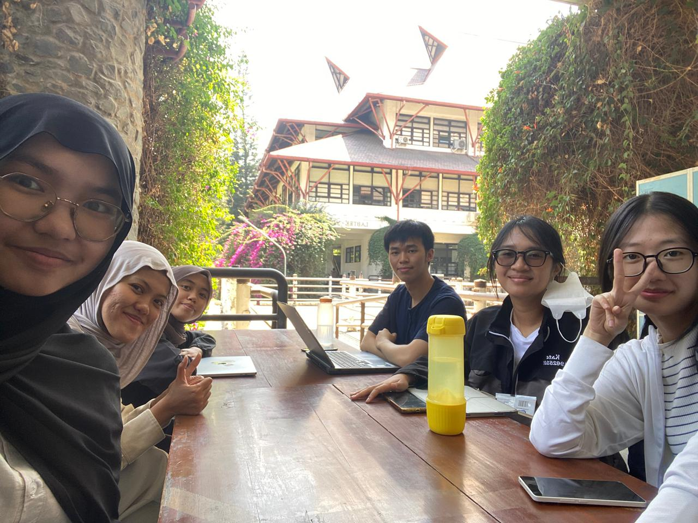

# Form Asistensi

## Tugas Besar IF2150 - Rekayasa Perangkat Lunak

| Informasi | Keterangan |
| --- | --- |
| **Hari** | Selasa |
| **Tanggal** | 01/09/2026 |
| **Kelas** | K03 |
| **Nomor Kelompok** | 5 |
| **Nama Kelompok** | HEYSRIUSLAH  |
| **Nama Perangkat Lunak** | LawHub |
| **Dokumen** | K03_G05_Template1_TB.md  |

### Anggota Kelompok

| NIM | Nama |
| --- | --- |
| 13525057 | Raya Medina Farrelin |
| 13525003 | Cherinette Corsane Khassyah Purceria |
| 13525108 | Khasya Nurul Amini |
| 13525150 | Livy Chandra|
| 13525138 | Cathrine Angel Siburian |

### Catatan

| Catatan |
| --- |
| 1. Untuk latar belakang, tambahkan data kuantitatif yang membuktikan bahwa masalah ini memiliki urgensi penyelesaian, sertakan juga contoh kasus nyata. |
| 2. Tentukan admin termasuk aktor pengguna langsung aplikasi atau tidak. Spesifikkan cara admin melayani keluhan pengguna. |
| 3. Tambahkan karakteristik yang membedakan tiap aktor. |
| 4. Untuk kebutuhan awal pengguna, *User Story* tidak harus satu setiap aktor, boleh ditambahkan sebanyak dan sespesifik mungkin (kegiatan apa saja yang akan dijalani oleh setiap aktor). |
| 5. Tidak semua aktivitas harus disertakan dalam diagram. Fitur yang berbeda boleh dibuat dalam diagram yang terpisah, begitu juga dengan aktor yang berbeda. |

## Dokumentasi

<!--  -->

  

  <i>Gambar 1. Dokumentasi kegiatan asistensi.</i>

